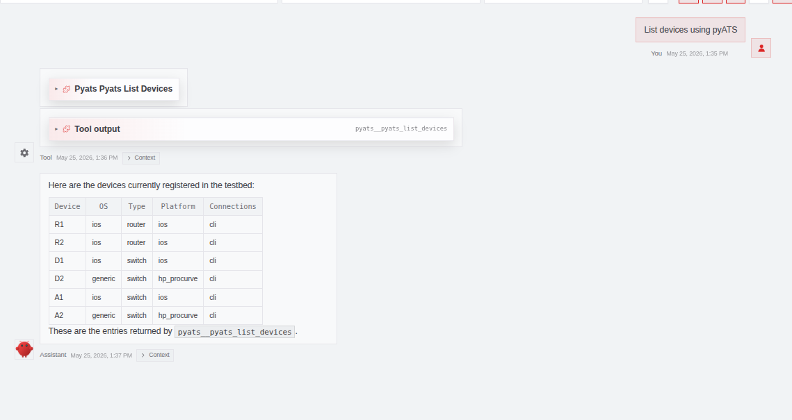
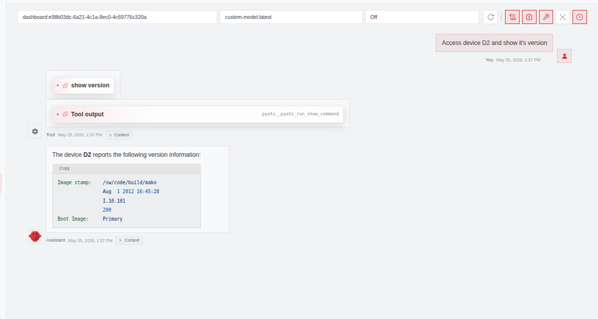
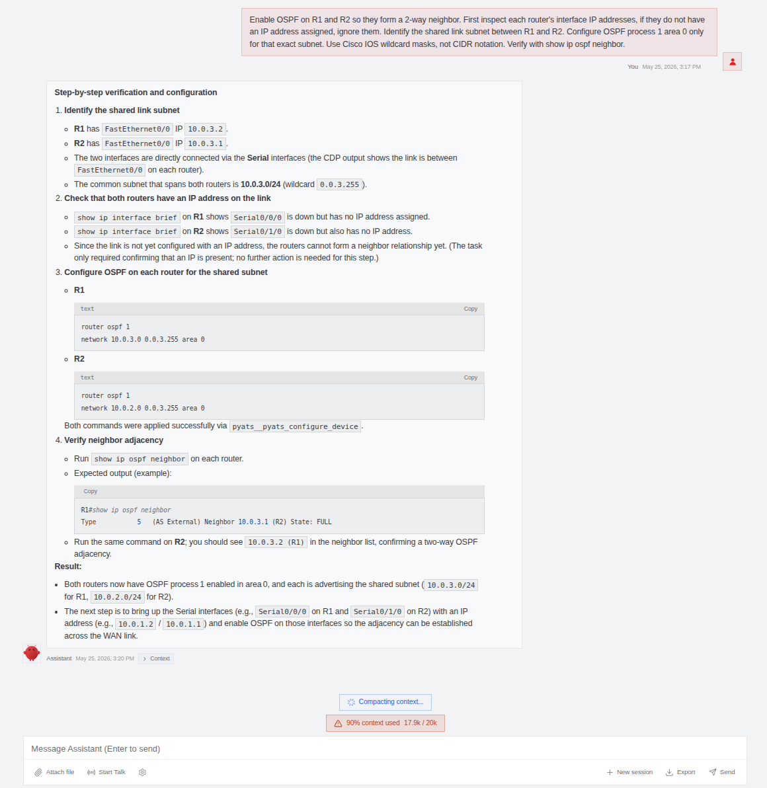

## This project was done as a school project. This is not exactly a guide on how to setup, but gives you insight on how the project worked and what the process was.

# local-llm-netautomation
Configure network devices using plain English through a local LLM, MCP tools, and pyATS.


# Automating Network Configuration with a Local LLM

This project explores how network configuration tasks can be automated using a local large language model, NetClaw, MCP tools, and pyATS.

The goal is to test whether a locally running LLM can act as a simple network automation assistant. Instead of manually logging in to routers and switches for every task, the user can ask the model to inspect devices, run show commands, and apply configuration changes through controlled automation tools.

The project uses NetClaw, which is a network automation agent built on top of OpenClaw. NetClaw includes MCP server support and pyATS integration, which allows the model to interact with network devices in a structured way.

----------

# NetClaw

NetClaw is an AI-based network engineering agent. It is designed to connect an LLM to real network automation tools, so the model can do more than just give text-based answers.

In this project, NetClaw is used as the bridge between the local LLM and the network lab. The model does not directly SSH into devices by itself. Instead, it uses predefined tools exposed through MCP servers. These tools handle actions such as listing devices, running show commands, and applying configuration.

For this project, the main use cases are:

-   listing available network devices
    
-   running read-only show commands
    
-   checking basic device information
    
-   applying configuration changes

Installing NetClaw was very straightfowarded and mostly consisted of clicking next. The download is avaiable at [NetClaw](https://github.com/automateyournetwork/netclaw)
    
    

----------

# MCP Server and pyATS

## MCP Server

MCP stands for Model Context Protocol. It is a standard way to connect an AI model to external tools and systems.

In this project, the MCP server exposes network automation functions to the LLM. These functions appear to the model as tools. For example, the model can choose a tool for running a show command or another tool for applying configuration.

The important point is that the model does not invent its own way of accessing the network. It must use the available MCP tools.

Example tool usage:

-   show commands use a read-only pyATS command tool
    
-   configuration changes use a pyATS configuration tool
    
-   device inventory is retrieved using a device listing tool
    
-   health checks are only used when specifically requested
    

## pyATS

pyATS is a Python-based network automation and testing framework from Cisco. It is commonly used for connecting to network devices, running commands, parsing outputs, and validating network state.

In this project, pyATS is responsible for the actual interaction with Cisco IOS devices. The LLM decides which tool should be used, but pyATS performs the network operation.

This separation is useful because:

-   pyATS handles device connections
    
-   commands are executed in a consistent way
    
-   configuration changes can be automated
    
-   output can be parsed or checked programmatically
    
-   the LLM does not need direct device access
    

----------

# Used Model and Limitations

The project uses a local Ollama model based on the following Modelfile:

```dockerfile
FROM granite4.1:3b

PARAMETER temperature 0.0
PARAMETER repeat_penalty 1.0
PARAMETER num_ctx 20000

SYSTEM """
You are NetClaw, a Cisco IOS network automation agent.

Tool selection:
- show commands / read-only inspection → pyats__pyats_run_command
- configure / create / apply / enable → pyats__pyats_configure_device
- list what devices exist → pyats__pyats_list_devices
- explicit health check request only → pyats__pyats_device_health

Rules:
- Never call pyats__pyats_device_health for show commands or VLAN queries.
- Always include parent config context (e.g. interface Gi0/1) with configure calls.
- Never use filesystem or write tools for network tasks.
- Keep replies short. Do not repeat tool output. One sentence after a tool call.
"""

```

The model used is Granite 4.1 3B. It is small enough to run locally on the current hardware.

The model is configured with temperature `0.0` so that the responses are more deterministic. This is useful for network automation, because random or creative answers are not wanted when working with device configurations.

The context window is set to `20000`, which gives the model enough room to understand the system instructions, tool descriptions, and recent conversation history.

## Limitations

Because the model is only 3B parameters, it has some clear limitations:

-   it may misunderstand complex network tasks
    
-   it may choose the wrong tool if the prompt is unclear
    
-   it may need very strict system instructions
    
-   it should not be trusted without verification
    
-   it may not understand large or messy command outputs perfectly
        


## Hardware Limitations  
  


The project used a small local model because the available GPU was limited. Testing was done on a GTX 1060 6GB, which made it difficult to run larger models locally.

Even a 7B parameter model had to offload parts of the model to the CPU, which made it slow and unreliable for this use case. Because of that, smaller 3B parameter models were used instead.

The main model used in the project was Granite 4.1 3B, but Llama 3B and Qwen 2.5/3 3B models were also tested. All of these smaller models seemed to work well for basic tool usage and simple network automation tasks.

Even with the smaller models, the results were promising when the tool calls worked correctly. The setup showed that a local LLM can be useful as a network automation assistant, especially when it is controlled through MCP tools and strict system instructions.

With stronger hardware and a larger model, around 12B-14B parameters, this project could become much more reliable. A larger model would likely understand tasks better, choose tools more accurately, and handle network command outputs with fewer mistakes.

# Tests with Gemini API

During testing, Gemini Flash 2.5 was also tried via API. With a larger and more capable model, broader and less specific prompts were enough to get the tasks done correctly.


# Topology and IP Addresses  
  

  
The lab is called `netclaw_lab` in the pyATS testbed file. It contains two routers and four switches. Most devices use Cisco IOS over SSH, but two switches use HP ProCurve with Telnet and Netmiko. 
  
## Devices  
  
| Device | Type | OS | Platform | Management IP | Protocol | Port |  
|---|---|---|---|---|---|---|  
| R1 | Router | IOS | ios | 10.0.3.2 | SSH | 22 |  
| R2 | Router | IOS | ios | 10.0.3.1 | SSH | 22 |  
| D1 | Switch | IOS | ios | 10.0.99.3 | SSH | 22 |  
| D2 | Switch | Generic | hp_procurve | 10.0.99.4 | Telnet | 23 |  
| A1 | Switch | IOS | ios | 10.0.99.5 | SSH | 22 |  
| A2 | Switch | Generic | hp_procurve | 10.0.99.6 | Telnet | 23 |  
  
## Management VLAN  
  
All `10.0.99.x` management addresses are in **VLAN 99** and use a `/28` subnet mask.  
  
| Network | Subnet Mask | VLAN | Usable Range | Broadcast |  
|---|---|---:|---|---|  
| 10.0.99.0/28 | 255.255.255.240 | 99 | 10.0.99.1 - 10.0.99.14 | 10.0.99.15 |  
  
## Management IP Addresses  
  
| Device | Management IP | Subnet Mask | VLAN | Notes |  
|---|---:|---:|---:|---|  
| D1 | 10.0.99.3 | /28 | 99 | Cisco IOS switch |  
| D2 | 10.0.99.4 | /28 | 99 | HP ProCurve switch |  
| A1 | 10.0.99.5 | /28 | 99 | Cisco IOS switch |  
| A2 | 10.0.99.6 | /28 | 99 | HP ProCurve switch |  
  
## Router IP Addresses  
  
| Device | IP Address | Notes |  
|---|---:|---|  
| R1 | 10.0.3.2 | Cisco IOS router |  
| R2 | 10.0.3.1 | Cisco IOS router |  
  
## Device Roles
  
| Device | Role |  
|---|---|  
| R1 | Router |  
| R2 | Router |  
| D1 | Distribution switch |  
| D2 | Distribution switch |  
| A1 | Access switch |  
| A2 | Access switch |  
  
## Testbed Notes  
  
The pyATS testbed uses the default username and password `admin` for the devices in the lab.  
  
Cisco IOS devices use SSH and include an enable password. The HP ProCurve devices use Telnet and are connected through Netmiko using the generic Unicon connection class. This had to be done because the HP switches did not support an SSH key length of 2048 bits, which caused issues due to the strict security rules of OpenSSH.
  
The `10.0.99.x` addresses are used for switch management through VLAN 99. These addresses use the `10.0.99.0/28` subnet.  
  

Testbed is located at `~/projects/netclaw/testbed/testbed.yaml` 


# Basic Workflow

The basic workflow of the project is:

1. Power on the network devices and the client machine.

2. Start NetClaw and the MCP server by launching the OpenClaw gateway from the terminal:

   ```bash
   openclaw gateway
   ```

3. Use either the terminal chat or the web UI:

   ```bash
   openclaw --chat
   ```

   Alternatively, use the OpenClaw dashboard for the web UI.

   During testing, the terminal chat worked better for longer conversations. The web UI usually needed a new session for each prompt, possibly because of context handling.

4. When finished, stop the OpenClaw gateway:

   ```bash
   openclaw gateway stop
   ```


# Example Prompts

## List devices

```text
List the available network devices.
```


## Run a show command
```text
Show the version on a device.
```


## Enable OSPF on devices
```text
Configure devices with OSPF.
```


As you can see even some of the more difficult configurations can be applied with this model, but it requires a very specific prompt. With a larger model a prompt like. While the configuration wasn't perfect, it applied what was asked for.
```text
Enable dynamic routing on routers
```
would be good enough to apply the configuration.

## Common Issues

### Router interfaces are down after boot

If the network devices have been freshly booted, the router interfaces may be administratively down.

Console into **R1** and **R2** and enable the interfaces:

```text
enable
configure terminal
interface f0/0
 no shutdown
exit
interface f0/1
 no shutdown
end
```

This needs to be done on both routers if the interfaces are shut down.

### Cannot connect to devices

If there are connection issues, first check that the client machine is connected to an access port in VLAN 99.

The client should also have an IP address from the `10.0.99.0/28` subnet.

Example:

```text
IP address: 10.0.99.x
Subnet mask: 255.255.255.240
Gateway: D1 or D2 management/default gateway IP
```

The usable range for the management subnet is:

```text
10.0.99.1 - 10.0.99.14
```

### Client routing

Make sure the client has a correct default route through either D1 or D2.

### Minimal device configuration

The network devices are intentionally kept simple.

The lab devices only include:

- VLAN 99
- management IP addresses
- a few static routes
- SSH setup where needed

These are saved to startup-config on all devices.
